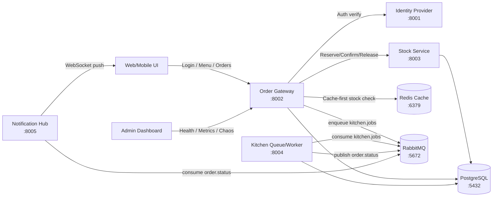

# Smart Cafeteria System (DevSprint 2026)

Smart Cafeteria System is a fault-tolerant microservices platform built for Ramadan rush-hour cafeteria traffic. It prioritizes fast order acknowledgment, strict stock safety under burst load, real-time order visibility, and graceful behavior during partial service failures.

## 1) Architecture

All core services run in separate containers and communicate over HTTP + message queue.



## 2) Required Services and Responsibilities

| Service | Purpose | Key Endpoints |
|---|---|---|
| Identity Provider | AuthN/AuthZ, JWT issuer, single source of truth for identity | `POST /login`, `GET /verify`, `GET /health`, `GET /metrics` |
| Order Gateway | API entry point, mandatory JWT validation, cache-first stock gate before stock/DB-heavy flow | `POST /api/login`, `GET /api/menu`, `POST /api/orders`, `GET /api/orders/{id}`, `GET /health`, `GET /metrics`, `GET /api/admin/metrics` |
| Stock Service | Inventory source of truth, oversell prevention with concurrency control (optimistic locking/versioning strategy), stock never negative | `GET /stock/{item_id}`, `POST /stock/reserve`, `POST /stock/confirm`, `POST /stock/release`, `GET /health`, `GET /metrics` |
| Kitchen Queue/Worker | Async order processing, decoupled from client ACK path | `GET /health`, `GET /metrics` |
| Notification Hub | Real-time order status push to clients (WebSocket), no polling in judged flow | `WS /ws?token=...`, `WS /ws/orders/{order_id}?token=...`, `GET /health`, `GET /metrics` |

## 3) End-to-End Flow

### A. Login -> JWT
1. Client sends credentials to `POST /api/login` (gateway).
2. Gateway delegates auth to Identity Provider.
3. Identity Provider returns signed JWT.
4. Gateway returns token + user profile.

### B. Place Order -> ACK under 2s
1. Client calls `POST /api/orders` with:
   - `Authorization: Bearer <token>`
   - `Idempotency-Key: <client-generated-key>`
2. Gateway validates JWT (mandatory).
3. Gateway performs cache-first stock gate (fast reject on known zero stock).
4. Gateway reserves stock through Stock Service (concurrency-safe, non-negative invariant).
5. Gateway enqueues kitchen job and immediately acknowledges order (target ACK <2s).

### C. Kitchen + Real-Time Tracking
1. Kitchen worker consumes `kitchen.jobs` and simulates prep (3-7 seconds).
2. Status changes are published to `order.status`.
3. Notification Hub pushes updates via WebSocket to the UI tracker in real time.
4. UI order tracker updates without polling.

## 4) Local Run Guide

### Prerequisites
- Docker + Docker Compose
- Node.js 20+
- npm

### Start everything (single command)
```bash
docker compose -f infra/docker-compose.yml up -d --build
```

### Optional: run web/mobile clients
```bash
npm --prefix apps/web install
npm --prefix apps/mobile install
npm --prefix apps/web run dev
npm --prefix apps/mobile start
```

### Quick verification with curl
```bash
curl -i http://localhost:8001/health
curl -i http://localhost:8002/health
curl -i http://localhost:8003/health
curl -i http://localhost:8004/health
curl -i http://localhost:8005/health
```

## Configuration

### Frontend environment
Web (`apps/web/.env.local`)
```bash
NEXT_PUBLIC_API_MODE=real
NEXT_PUBLIC_API_BASE_URL=http://localhost:8002
NEXT_PUBLIC_API_PREFIX=/api
NEXT_PUBLIC_NOTIFICATION_WS_URL=ws://localhost:8005/ws
ACCESS_COOKIE_NAME=access_token
```

Mobile (`apps/mobile/.env`)
```bash
EXPO_PUBLIC_API_MODE=real
EXPO_PUBLIC_API_BASE_URL=http://localhost:8002
EXPO_PUBLIC_API_PREFIX=/api
EXPO_PUBLIC_NOTIFICATION_WS_URL=ws://localhost:8005/ws
```

### Env file locations
| Scope | File / Location | Notes |
|---|---|---|
| Root template | `.env.example` | Example env template committed to repo. |
| Web app | `apps/web/.env.local` | Next.js client/runtime env values. |
| Mobile app | `apps/mobile/.env` | Expo public env values. |
| Backend services | `infra/docker-compose.yml` (`environment:` blocks) | Runtime env is injected per service container. |
| Service defaults | `services/*/main.py` (`os.getenv(...)`) | Fallback defaults used if env not provided. |

### Backend/runtime knobs (optional)
- `RESERVATION_TTL_SECONDS` (stock reservation TTL)
- `RESERVATION_REAPER_INTERVAL_SECONDS` (stock release worker interval)
- `ADMIN_HEALTH_CHECKS_JSON` (custom admin health check targets)
- `JWT_SECRET`, `JWT_EXPIRES_MINUTES` (auth token config)

### CORS configuration
- Services support CORS origin configuration through `CORS_ALLOWED_ORIGINS`.
- Local example:
```bash
CORS_ALLOWED_ORIGINS=http://localhost:3000,http://127.0.0.1:3000,http://localhost:8081,exp://127.0.0.1:19000
```
- Include your deployed frontend origin(s) in production.

### Infrastructure defaults
- Docker Compose file: `infra/docker-compose.yml`
- Deterministic DB bootstrap from:
  - `database/001_schema.sql`
  - `database/002_seed.sql`

### Deployment note (Vercel)
- Current Vercel deployment is **frontend-only** (Next.js app).
- Backend microservices (Identity, Gateway, Stock, Kitchen, Notification, Postgres, Redis, RabbitMQ) are **not** hosted on Vercel and must run separately.

## 5) API Quickstart

### Login
```bash
TOKEN=$(curl -s -X POST http://localhost:8002/api/login \
  -H "Content-Type: application/json" \
  -d '{"student_id":"240041246","password":"pass123"}' \
  | python3 -c 'import json,sys; print(json.load(sys.stdin)["access_token"])')

echo "$TOKEN"
```

### Place order (JWT + Idempotency-Key)
```bash
curl -s -X POST http://localhost:8002/api/orders \
  -H "Authorization: Bearer $TOKEN" \
  -H "Idempotency-Key: demo-order-001" \
  -H "Content-Type: application/json" \
  -d '{"items":[{"id":"1","qty":1}]}'
```

### Check stock directly
```bash
curl -s http://localhost:8003/stock/1
```

### Real-time tracking (WebSocket)
Using `wscat`:
```bash
npx wscat -c "ws://localhost:8005/ws?token=$TOKEN"
```

Single-order stream:
```bash
npx wscat -c "ws://localhost:8005/ws/orders/<ORDER_ID>?token=$TOKEN"
```

## 6) Observability

### Health and metrics endpoints

| Service | Health | Metrics |
|---|---|---|
| Identity Provider | `GET http://localhost:8001/health` | `GET http://localhost:8001/metrics` |
| Order Gateway | `GET http://localhost:8002/health` | `GET http://localhost:8002/metrics` |
| Stock Service | `GET http://localhost:8003/health` | `GET http://localhost:8003/metrics` |
| Kitchen Queue/Worker | `GET http://localhost:8004/health` | `GET http://localhost:8004/metrics` |
| Notification Hub | `GET http://localhost:8005/health` | `GET http://localhost:8005/metrics` |

### Metrics meaning (judge-facing)
- `orders_total` / `orders_failed_total`: throughput and failure ratio.
- latency metrics (`p50`, `p95`, or avg): response-time behavior.
- queue depth (`kitchen.jobs`, `order.status`): async backlog pressure.
- service-specific counters (reserve/confirm/release, push failures, etc.).

## 7) Testing and CI

### Local checks
```bash
# End-to-end smoke
./scripts/smoke-test.sh

# Backend unit/integration (current baseline)
services/order-gateway/.venv/bin/python -m pytest -q services/order-gateway/tests

# Frontend quality gates
cd apps/web && npm run lint && npm run build -- --webpack
cd apps/mobile && npm run lint
```

### CI contract
- GitHub Actions (`CI`) runs on every push to `main`.
- Test or build failure must fail the pipeline.
- Submission target is green CI on `main`.

## 8) Failure Demo / Chaos Testing

Use admin dashboard chaos controls, API toggles, or direct container stop to simulate failure.

### Example: kill one service container
```bash
docker compose -f infra/docker-compose.yml stop notification-hub
```

Expected behavior:
- Login, menu, and order placement continue.
- Kitchen processing continues.
- Real-time push pauses while notification-hub is down.

Recover:
```bash
docker compose -f infra/docker-compose.yml start notification-hub
```

### Example: fail Stock Service
```bash
curl -s -X POST http://localhost:8003/chaos/fail \
  -H "Content-Type: application/json" \
  -d '{"enabled":true,"mode":"error"}'
```

Expected behavior:
- New order attempts degrade gracefully (controlled failure, no data corruption).
- Existing services remain alive.
- Stock never goes negative, no double deduction.

Recover:
```bash
curl -s -X POST http://localhost:8003/chaos/fail \
  -H "Content-Type: application/json" \
  -d '{"enabled":false,"mode":"error"}'
```

## 9) Admin Dashboard Requirements Coverage

`/admin` demonstrates:
- Health grid (green/red by real checks)
- Live metrics (latency, throughput, queue depth)
- Chaos toggle (service fail/recover)

### How admin accesses and uses facilities
1. Sign in with admin account:
   - Student ID: `admin-demo`
   - Password: `admin-pass`
2. Open `http://localhost:3000/admin`.
3. Use **Menu Manager** to create/update items, change stock, and toggle availability.
4. Use **Menu Windows** and **Menu Slot Assignment** to configure Ramadan windows and assign item IDs per slot.
5. Use **Kitchen Peak Mode** to enable/disable manual kitchen controls for rush operation.
6. Use **Chaos Control**:
   - Select target service
   - Choose `Kill` or `Restart`
   - Click `Run chaos` and observe health/metrics impact
   - Use `Recover all services` to clear fail mode quickly
7. Use **Service Health** + metric cards to monitor recovery (`latency`, `orders/min`, `kitchen.jobs`, `order.status` queue depth).

## 10) Monorepo Structure

```text
smart-cafeteria-system/
  apps/                # Frontend clients (web, mobile)
  services/            # FastAPI microservices
    identity-provider/
    order-gateway/
    stock-service/
    kitchen-queue/
    notification-hub/
  infra/               # docker-compose and infra configs
  database/            # deterministic schema + seed SQL
  docs/                # contracts, demo script, handoff docs
  scripts/             # health check, smoke test, utilities
```

## Mobile App (Short Guide)

- What it does: student-facing mobile flow for login, menu browsing, order placement, and order tracking using the same backend APIs.
- Where the code is: `apps/mobile/` (screens/components under `apps/mobile/src/`).
- How to run locally:
```bash
npm --prefix apps/mobile install
npm --prefix apps/mobile start
```
- Configuration: set API target in `apps/mobile/.env` (see `Configuration` section).
- Future use: package for Android/iOS and point to hosted backend infrastructure for campus-wide rollout.

## 11) Known Limitations and Next Steps

### Known limitations
- Current judged scope is core ordering + resilience + real-time tracking.
- Payment/wallet endpoints are retained as future scope and are not part of judged core flow.
- Production hardening (secrets vault, mTLS/service identity, rate-limit policy) is not fully implemented.
- Vercel hosting currently deploys frontend only; full backend stack requires separate runtime/infrastructure.

### Next steps
- Implement full payment state machine (`PAYMENT_PENDING -> CONFIRMED/FAILED`).
- Expand service-level tests beyond gateway baseline.
- Add centralized alerting/SLO dashboards.
- Add stronger production auth between internal services.

## 12) Demo Accounts and Ports

### Demo accounts
| Role | Student ID | Password |
|---|---|---|
| Admin | `admin-demo` | `admin-pass` |
| Student | `240041246` | `pass123` |

### Core ports
| Component | Port |
|---|---|
| Web UI | `3000` |
| Identity Provider | `8001` |
| Order Gateway | `8002` |
| Stock Service | `8003` |
| Kitchen Queue/Worker | `8004` |
| Notification Hub | `8005` |
| PostgreSQL | `5432` |
| Redis | `6379` |
| RabbitMQ | `5672` (`15672` UI) |

## 13) AI Tooling Acknowledgment

This project was developed with human engineering decisions and implementation support from AI coding assistants:
- ChatGPT
- Claude
- GitHub Copilot

All architecture, code, tests, and documentation changes were reviewed and integrated by the project team before submission.

## 14) Error Handling Guide

### API-level error conventions
- `400`: invalid request payload/business rule mismatch.
- `401`: missing/invalid/expired JWT.
- `403`: authenticated but not authorized (admin-only routes).
- `404`: resource not found.
- `409`: conflict (for example stock reservation conflict or idempotency clash).
- `422`: validation failure.
- `503`: dependency unavailable or service in chaos/fail mode.

### Service failure behavior
- Identity Provider down: login/verify flows fail fast with upstream unavailability.
- Stock Service down: order creation is rejected safely; stock remains consistent.
- Kitchen Queue down: order API remains responsive but processing degrades based on queue availability.
- Notification Hub down: ordering still works; real-time push pauses until recovery.

### Operational recovery checklist
```bash
# 1) Check container and endpoint health
make ps
./scripts/health-check.sh

# 2) Inspect failing service logs
docker compose -f infra/docker-compose.yml logs -f --tail=200 <service-name>

# 3) Restart only the failing service
docker compose -f infra/docker-compose.yml restart <service-name>

# 4) Re-run smoke test
./scripts/smoke-test.sh
```

### Client-side handling expectations
- Retry transient failures (`503`, network timeout) with bounded backoff.
- Never retry non-idempotent order creation without the same `Idempotency-Key`.
- Show user-safe fallback states:
  - auth expired -> redirect to login
  - real-time channel disconnected -> show reconnecting status
  - order conflict -> show latest stock/status from server
